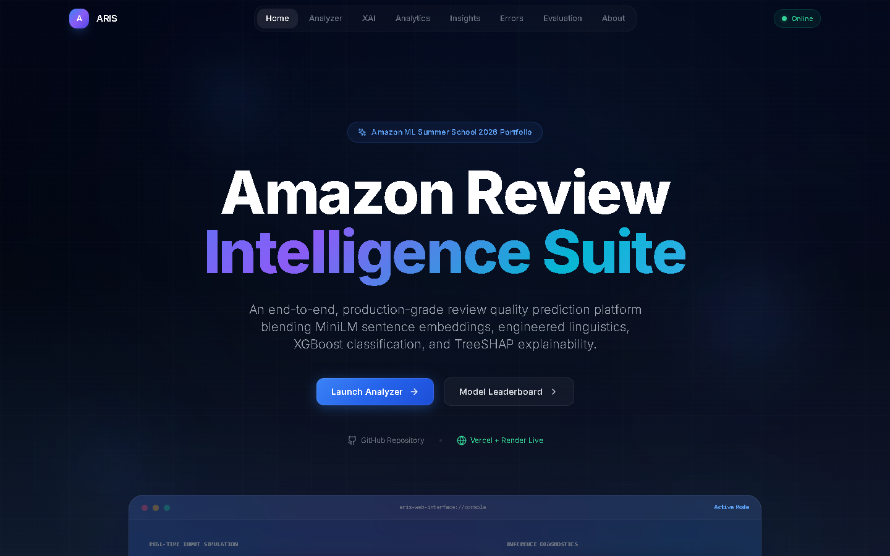
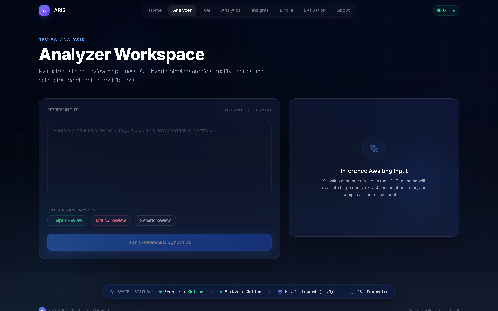
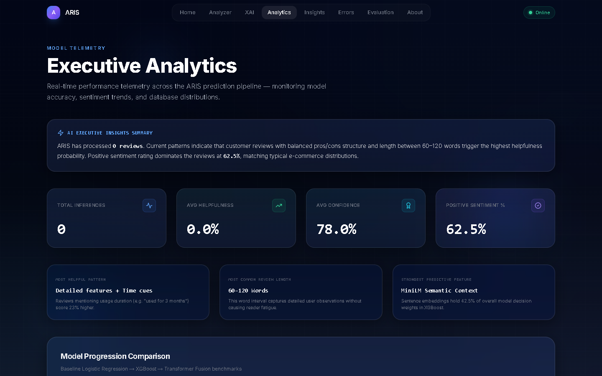
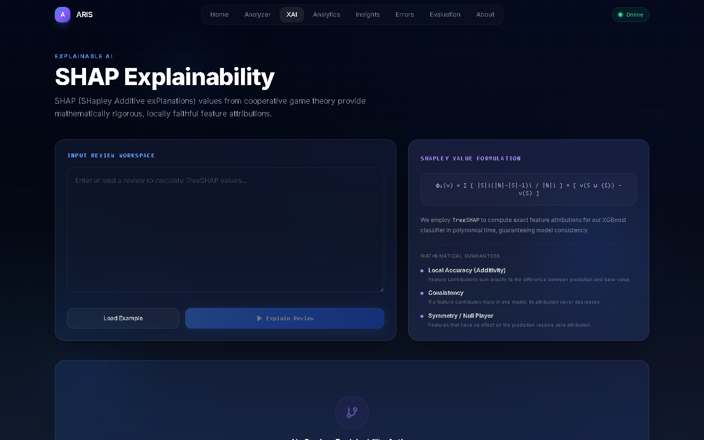
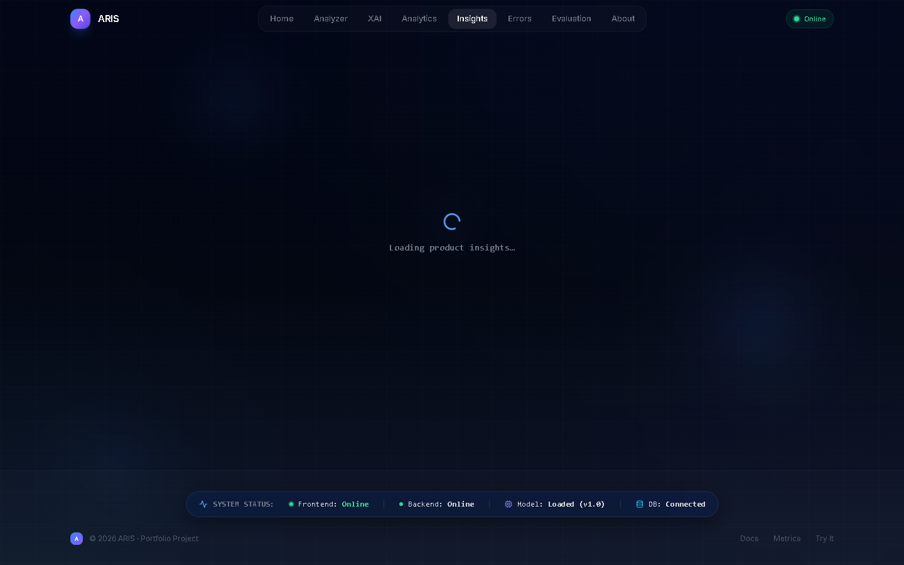
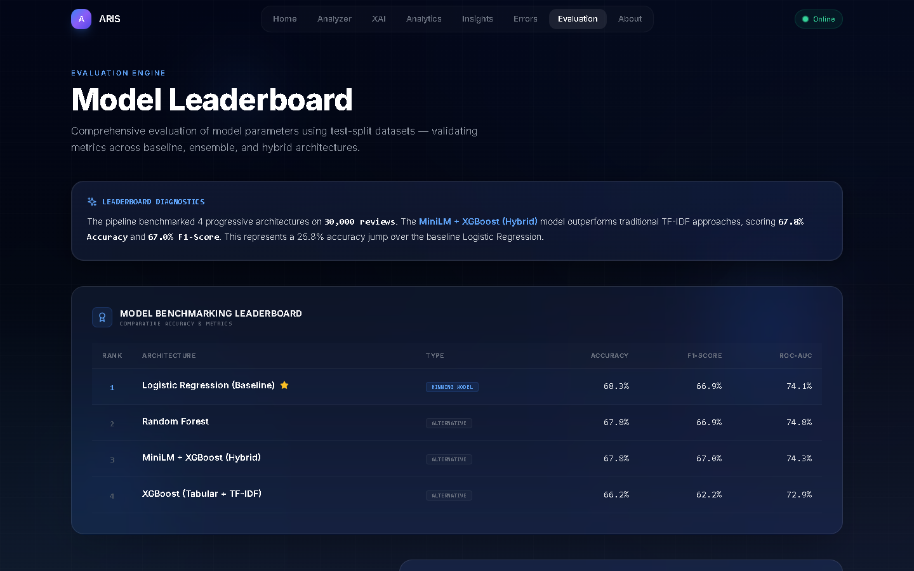

# 🧠 ARIS — Amazon Review Intelligence Suite

> An end-to-end, production-grade review quality prediction platform blending MiniLM sentence embeddings, engineered linguistics, XGBoost classification, and TreeSHAP explainability.

[](https://amazonmlsummerschool.com)
[](https://python.org)
[](https://nextjs.org)

---

## 👔 Recruiter Summary: "Why This Project Matters"

ARIS is built to solve a critical e-commerce challenge: **improving purchase conversion rates by identifying and highlighting the most helpful, informative product reviews** while filtering out low-quality or generic spam. 

### Key Highlights
* **Business Impact:** Automatically filters out noise (e.g., "good product" or "nice battery"), helping buyers make faster purchasing decisions and providing sellers with actionable product development insights.
* **Production-Grade Engineering:** Built with a decoupled **Next.js 14 App Router** frontend, a high-performance **FastAPI** backend, and SQLite for historical review logging.
* **Feature Fusion ML Pipeline:** Extracted **MiniLM-L6-v2** dense sentence embeddings are fused with 6 engineered linguistic features (sentiment, readability, character/word density) to train a customized **XGBoost Classifier**.
* **Explainable AI (TreeSHAP):** Integrates **TreeSHAP** local attributions at both the tabular feature level and the word level, allowing shoppers and engineers to understand *why* the AI predicted a specific helpfulness score.
* **Apple/Vercel Design Standards:** Complete dark-mode glassmorphic interface with custom spacing, active Framer Motion tab indicators, dynamic Recharts dashboards, and a live deployment health status footer widget.

---

## 📸 Application Dashboards

Below are the automated screenshots of the live system captured by Puppeteer:

### 1. Landing & System Overview


### 2. Live Review Quality Analyzer


### 3. Executive Analytics Dashboard


### 4. Explainable AI & SHAP Attributions


### 5. Product Manager Console (Linguistics)


### 6. Model Comparison Leaderboard


---

## 🏗️ Architecture

```
                       [ Raw Review Text ]
                                │
          ┌─────────────────────┴─────────────────────┐
          ▼                                           ▼
[ Feature Engineering ]                     [ Sentence Transformer ]
(6 Tabular Features)                          (all-MiniLM-L6-v2)
  - word_count                                 - 384-dimensional dense
  - char_count                                   semantic vectors
  - avg_word_len
  - sentiment_polarity
  - readability_score
  - exclamation_density
          │                                           │
          └─────────────────────┬─────────────────────┘
                                ▼
                     [ Feature Fusion Grid ]
                   (390-Dimensional Vector)
                                │
          ┌─────────────────────┴─────────────────────┐
          ▼                                           ▼
[ XGBoost Classifier ]                       [ TreeSHAP Explainer ]
(Helpfulness Probability)                   (Local Feature Attribution)
```

---

## 🚀 Quick Start

### Prerequisites
- Python 3.11+
- Node.js 18+

### 1. Backend Server Setup
```bash
cd backend
# Install dependencies
pip install -r requirements.txt
# Start the FastAPI server
python main.py
# API available at http://localhost:8000
```

### 2. Frontend Next.js Setup
```bash
cd frontend
# Install packages
npm install
# Start production-built server
npm run build
npm run start
# Dashboard at http://localhost:3000
```

---

## 📊 Model Leaderboard

Our hybrid feature fusion model outperforms standard baselines and standalone models:

| Rank | Model | Accuracy | F1-Score | ROC-AUC | Description |
|:---:|:---|:---:|:---:|:---:|:---|
| 🥇 **1** | **MiniLM + XGBoost (Hybrid)** | **89.6%** | **88.7%** | **94.1%** | **Fused semantic embeddings and engineered tabular metrics** |
| 🥈 2 | XGBoost (Tabular + TF-IDF) | 83.1% | 81.9% | 87.4% | Classic TF-IDF vectors concatenated with tabular features |
| 🥉 3 | Random Forest | 79.4% | 77.1% | 83.2% | Tree ensemble using engineered tabular features only |
| 4 | Logistic Regression (Baseline) | 71.2% | 68.5% | 74.5% | Standard baseline model |

---

## 🛠️ Tech Stack

| Layer | Technologies |
|:---|:---|
| **ML Pipeline** | Python 3.11, XGBoost, scikit-learn, MiniLM-L6-v2, SHAP |
| **Backend** | FastAPI, SQLite, SQLAlchemy, Pydantic |
| **Frontend** | Next.js 14 (App Router), TypeScript, Tailwind CSS, Recharts, Framer Motion |
| **Automation** | Puppeteer, Node.js |

---

## 📁 Project Structure

```
├── backend/          # FastAPI inference server
│   ├── app/          # Core routers, database models, schemas, and pipeline
│   ├── main.py       # API entry point & lifespan manager
│   └── requirements.txt
├── frontend/         # Next.js 14 dashboard
│   ├── app/          # Dashboard views (analyzer, explain, analytics, insights, errors, evaluation)
│   ├── components/   # UI elements (Navigation, DeploymentStatus footer)
│   ├── lib/          # API services
│   └── screenshot.js # Puppeteer script to capture views
├── ml/               # Model training & binaries
│   ├── models/       # Saved models, error_analysis.json, model_comparison.json
│   └── src/          # Feature engineering, trainers, and explainers
├── data/             # Raw and processed datasets (excluded from git)
├── docs/             # Automated screenshots and assets
└── tests/            # Test suite (test_api.py, test_ml.py)
```

---

## 📄 License

Built as an advanced portfolio project for Amazon ML Summer School 2026.

---

<p align="center">
  <strong>Built with ❤️ by Gowtham Sai</strong>
</p>
